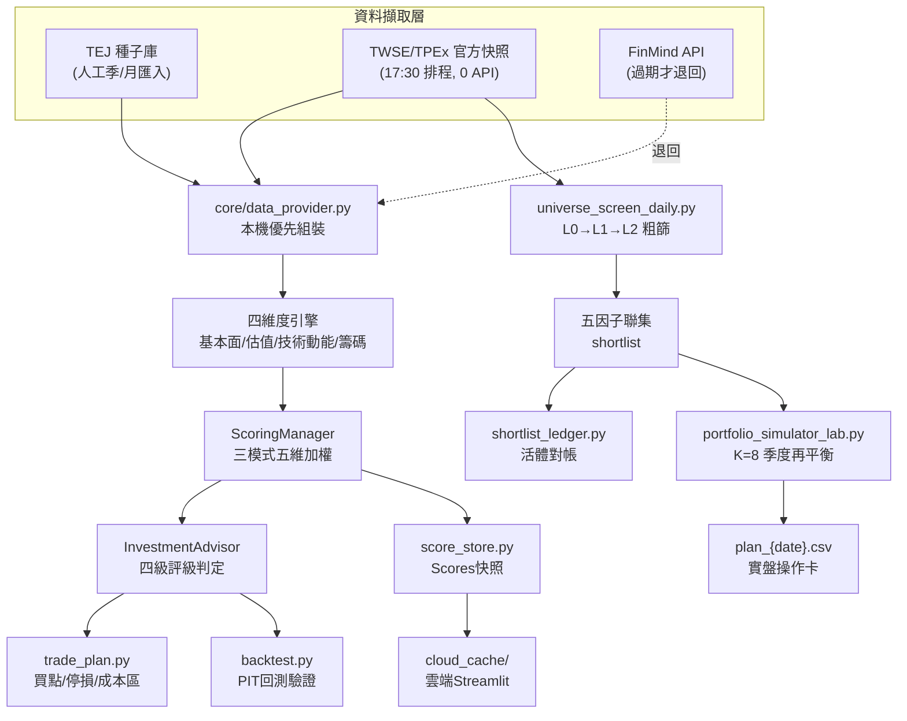

# 專案完整流程地圖 — 資料來源／篩選參數／運作流程

> 產生日期：2026-07-19。本文件由逐檔讀取當前程式碼（非讀 memory/舊 devlog 推測）整理而成，
> 目的是提供**足夠精確的節點與數字**，供你後續畫樹狀圖 / 流程圖使用。
> 所有數字均附 `file:line`，若程式碼之後變動，以程式碼為準。

---

## 0. 專案定位（一句話）

一套「研究/篩選輔助工具」：把台股個股拆成 **基本面／估值／技術／動能／籌碼** 五個維度，
用可回測、point-in-time（無未來函數）的邏輯打分、分級、產生買賣點建議；另有一條獨立的
「全市場 0-API 粗篩」管線，從 1,900+ 檔中每天篩出 shortlist；最上層是「組合層」，把 shortlist
的訊號轉成 K=8 檔的季度再平衡實盤投組操作卡。**不是投資建議、不會下單。**

三種使用介面：`main.py`（CLI）／`app.py`（Streamlit 網頁，6 個分頁）／`tests/run_backtest.py`（回測）。

---

## 1. 頂層模組樹（供畫樹狀圖）

```
Project 1/
├─ 進入點 (Entry Points)
│  ├─ main.py            單檔分析／多檔排行 (CLI)
│  ├─ app.py              Streamlit 網頁 (6 分頁)
│  ├─ build_cache.py       快取建庫／分數重算／示範選股
│  ├─ deploy_scores.py     本機 scores → cloud_cache 上雲
│  ├─ tests/run_backtest.py  回測 CLI
│  ├─ tej_importer.py      TEJ 批次匯入器
│  ├─ portfolio.py         watchlist 觀察表 + 事後追蹤
│  ├─ validate_scores.py   分數驗證
│  └─ audit_data_completeness.py  資料完整度稽核
│
├─ core/  （核心引擎，個股層級）
│  ├─ config.py            .env / FinMind 登入
│  ├─ data_provider.py     ★資料組裝總樞紐（本機優先→FinMind退回）
│  ├─ data_cache.py        FinMind 讀寫穿透 Parquet 快取
│  ├─ crawler.py           [已棄用] 備援爬蟲，不在主線
│  ├─ tdcc_provider.py     TDCC 集保大戶（預設關閉）
│  ├─ fundamentals.py      基本面引擎
│  ├─ valuation.py         估值引擎（含產業內位階）
│  ├─ industry_value.py    產業內估值位階查表
│  ├─ technical_analysis.py 技術指標計算（含量價分布）
│  ├─ market_sentiment.py  [未接線的獨立實驗模組]
│  ├─ sector.py            產業 A/B 分類（僅標籤，權重未接線）
│  ├─ regime.py            大盤多空 regime（0050+MA120，改分數權重）
│  ├─ scoring_manager.py   ★五維度加權評分
│  ├─ models.py            StockData / ScoreResult 資料結構 (無演算法)
│  ├─ advisor.py           ★評級判定 + 建議文字生成
│  ├─ trade_plan.py        買點/停損/成本區
│  ├─ backtest.py          回測引擎（PIT + 動態出場模擬）
│  └─ score_store.py       scores 快照存取 + weights_version
│
├─ scripts/  （全市場層級 + 研究實驗室）
│  ├─ market_snapshot_collector.py  每日官方快照收集器 (0 FinMind API)
│  ├─ build_industry_value_ref.py   全市場產業位階參考表
│  ├─ universe_screen_daily.py      ★L0→L1→L2 粗篩 + 五因子聯集 shortlist
│  ├─ universe_screen_backfill.py   歷史回補版
│  ├─ universe_digest.py            每日摘要 digest
│  ├─ shortlist_ledger.py           ★活體對帳（軌1池級/軌2使用面）
│  ├─ portfolio_simulator_lab.py    ★組合層規則（K/再平衡/執行時點，已凍結）
│  ├─ daily_auto_update.bat / register_daily_task.*      排程1
│  ├─ market_snapshot_collect.bat / register_market_snapshot_task.*  排程2
│  └─ 其餘 *_lab.py                 研究實驗室（已結案的預註冊實驗，不在生產路徑）
│
├─ dynamic_stop_engine.py   三道動態停損防線
├─ Volume profile.py        [部分過時的獨立版量價分布，正式路徑用 core/technical_analysis.py]
│
├─ 資料落地（本機，多為專案外部路徑）
│  ├─ ~/tej_cache/           TEJ 人工批次匯入種子（無 PIT 保證，歷史深）
│  ├─ ~/market_cache/        官方每日快照（TWSE/TPEx，逐日累積，0 FinMind API）
│  ├─ ~/finmind_cache/       FinMind 讀寫穿透快取（查過即存）
│  ├─ data/tdcc/, data/industry_map.json   小型靜態/週頻資料
│  ├─ outputs/universe_pool/  pool_*.csv / shortlist_*.csv / digest_*.md / plan_*.csv
│  ├─ outputs/portfolio/      watchlist 觀察表 tracking.csv
│  └─ cloud_cache/            上雲快照 (Scores/, UniversePool/)
│
└─ tej_exports/inbox_*/    TEJ 手動匯出檔案的暫存收件匣（依 dataset 分 9 個子目錄）
```

---

## 2. 資料擷取層：來源、路徑、新鮮度門檻

### 2.1 三層本機儲存 + FinMind 兜底

| 儲存層 | 環境變數(預設路徑) | 建立方式 | 內容 |
|---|---|---|---|
| TEJ 種子庫 | `TEJ_CACHE`(`~/tej_cache`) | 人工批次匯入 `tej_importer.py`（每季/每月手動匯出丟 inbox 重跑） | TEJ Pro 歷史資料，2004–2026 全歷史（依 dataset） |
| 官方每日快照庫 | `MARKET_CACHE`(`~/market_cache`) | `scripts/market_snapshot_collector.py` 排程（平日17:30） | TWSE/TPEx 官方開放端點，逐日累積 |
| FinMind 讀寫穿透快取 | `FINMIND_CACHE`(`~/finmind_cache`) | `core/data_cache.py` 包住 FinMind DataLoader | 打過 API 的結果自動落地重用 |
| 產業/TDCC 週資料 | 專案內 `data/` | `data_provider.py` / `tdcc_provider.py` | 全市場小檔案 |

### 2.2 每個資料集：本機優先 → FinMind 退回 一覽表

| 資料集(用途) | 主要來源 | 新鮮度門檻(超過即退回FinMind) | FinMind Fallback API | 關鍵位置 |
|---|---|---|---|---|
| 日K + PER/PBR/殖利率 | TEJ ∪ 官方快照(重疊日以TEJ為準) | 最新日落後 **>7天** | `TaiwanStockPrice` / `TaiwanStockPER` | `data_provider.py:360-387` |
| 法人買賣超毛額(籌碼) | TEJ `institutional_gross` ∪ 收集器 | 覆蓋度<40筆(90天窗) 或 落後**>7天** | `TaiwanStockInstitutionalInvestorsBuySell` | `data_provider.py:244-289` |
| 融資餘額 | TEJ `margin_balance` ∪ 收集器 | 覆蓋度<30筆 或 落後**>8天** | `TaiwanStockMarginPurchaseShortSale` | `data_provider.py:291-317` |
| 流通股數/外資持股比率 | **僅**收集器(無TEJ種子) | 落後**>10天** | `TaiwanStockShareholding` | `data_provider.py:319-338` |
| 月營收 | TEJ ∪ 收集器(含`release_date`真實公告日) | 落後**>70天** | `TaiwanStockMonthRevenue` | `data_provider.py:389-437` |
| 三大財報(季) | **僅**TEJ種子(收集器未涵蓋) | 落後**>175天** | 三支API：財報/資產負債表/現金流量表 | `data_provider.py:439-546` |
| 產業別 | 本機JSON快取(來源=FinMind一次性全市場) | 快取檔**30天**內視為新鮮 | `TaiwanStockInfo` | `data_provider.py:1064-1134` |
| TAIEX大盤位階 | 純FinMind(無持久快取，每次執行重抓1支) | 無 | `TaiwanStockTotalReturnIndex` (data_id='TAIEX') | `data_provider.py:975-1007` |

**現況（單檔分析 API 用量）**：本機資料齊全時，單檔分析 = **0 FinMind API**（僅程序級 TAIEX 1 支 + 每30天產業別1支）；雲端訪客/本機資料過期時，仍會退回 FinMind，約 **9 支請求/新股**（股價、法人、流通股、融資融券、月營收、PER河流圖、損益表、資產負債表、現金流量表）。

### 2.3 `tej_importer.py` — 人工批次匯入的 10 個 dataset

| `--dataset` | 匯入來源目錄 | 欄位重點 |
|---|---|---|
| `price_valuation` | `tej_exports/inbox/` | 開高低收量、PER/PBR/殖利率(TSE+TEJ雙口徑) |
| `institutional_flow` | `tej_exports/inbox_chip/` | 外資/投信/自營淨額 |
| `financial_statements`(16欄) | `tej_exports/inbox_fundamentals/` | 營收/毛利/營業利益/淨利/EPS/資產負債/OCF/capex |
| `monthly_revenue`(8欄) | `tej_exports/inbox_revenue/` | 含`release_date`真實公告日(PIT用) |
| `industry_map` | `tej_exports/inbox_industry/` | TSE/TEJ產業代碼、TEJ子產業 |
| `institutional_gross`(15欄) | `tej_exports/inbox_chip_gross/` | 外資/投信買賣張數毛額、持股率% |
| `margin_balance`(10欄) | `tej_exports/inbox_margin/` | 融資融券餘額、券資比 |
| `tdcc_weekly` | `tej_exports/inbox_tdcc/` | 各級距持股比率、集保總人數 |
| `director_pledge` | `tej_exports/inbox_pledge/` | 董監質押%、集團名稱(未用於任何驗證) |

**維護節奏**：月營收每月10號後、財報每季公告後（Q2=8/14）手動去 TEJ 匯出丟 inbox 重跑匯入器。

### 2.4 `scripts/market_snapshot_collector.py` — 每日官方快照（0 FinMind API）

| 收集函式 | 端點 | 輸出子目錄 | 資料日判定 |
|---|---|---|---|
| `collect()` 主價格/PE | TPEx `mainboard_daily_close_quotes`+`peratio_analysis`；TWSE `afterTrading/MI_INDEX`+`BWIBBU_d`(rwd) | `price_valuation_daily/` | 以TPEx日期為準，未發布最多重試8次×600秒 |
| `collect_chip()` 三大法人 | TWSE `fund/T86`(rwd)；TPEx `3insti_daily_trading` | `institutional_flow_daily/` | 失敗只記log不中斷整批 |
| `collect_margin()` 融資餘額 | TWSE `marginTrading/MI_MARGN`；TPEx `mainboard_margin_balance` | `margin_daily/` | TWSE往回補最多4天 |
| `collect_shareholding()` 股數/外資比率 | TWSE `t187ap03_L`+`fund/MI_QFIIS`；TPEx `mopsfin_t187ap03_O` | `shareholding_daily/` | 外資比率往回試最多4天 |
| `collect_monthly_revenue()` 月營收 | TWSE `t187ap05_L`；TPEx `mopsfin_t187ap05_O` | `monthly_revenue/{YYYY-MM}.parquet` | PIT快照：只追加新公告，不覆蓋既有 |

發布時序：**目標交易日由TPEx openapi決定**(當天14-16點翻日)，TWSE走rwd介面依此日精準抓(當天下午即發布)→傍晚17:30收當天資料成立。

---

## 3. 全市場粗篩層（0 FinMind API，1,900+ 檔 → shortlist）

### 3.1 篩選漏斗

```
全市場(TEJ∪快照，含下市股)
   │
   ▼ 今日有報價 (close.notna())
   │
   ▼ L0 因子可評估：value_pct 非空 (PE史料≥60筆樣本，起算2019-01-01)
   │
   ▼ L1 可投資性：20日均成交額≥1,000萬 且 上市滿一年
   │      (≈700-810檔候選池 → pool_{date}.csv)
   │
   ▼ L2 陷阱排除：剔除「全市場PE分位>90 且 最新月營收YoY非正(含未知)」
   │
   ▼ 五因子聯集(池內百分位>85，任一因子即入榜)
   │      → shortlist_{date}.csv (≈400-480檔)
   ▼
digest_{date}.md (每日摘要)
```

**精確門檻**（`scripts/universe_screen_daily.py`）：
- L0：`MIN_PCT_SAMPLES=60`，`PE_HISTORY_START="2019-01-01"`（line 164, 50-51）
- L1：`adv20 >= 10,000,000` NTD，`listed_ok` = 首見日≤2019-01-10 或 (as_of−首見日)≥365天（line 92, 119-124, 165）
- L2：`value_pct > 90`（全市場橫斷面分位）且 `revenue_yoy` 非正含未知（line 166-167）

### 3.2 五因子聯集表

| 因子 | 計算邏輯 | 門檻 |
|---|---|---|
| `value_ind_pct` 產業內估值位階 | 查 `industry_value_ref.parquet` | 池內百分位>85 |
| `momentum20` 20日動能 | `(close_t−close_t-21)/close_t-21×100` | 池內百分位>85 |
| `chip20_turnover` 20日法人週轉 | `net20(外資+投信+自營)/vol20` | 池內百分位>85 |
| `high52_prox` 52週高接近度 | `close / max(近240交易日收盤)×100` | 池內百分位>85 |
| `rev_accel` 營收加速度 | `最新月營收YoY − 近3月YoY均值`(PIT: 月底+10天才算已知) | 池內百分位>85 |

**排序欄 `c2_score`**（實際排序依據）= 四項池內百分位等權平均，動能反向：
`mean(value_ind_pct_pool_pct, revenue_yoy_pool_pct, high52_prox_pool_pct, 100−momentum20_pool_pct)`
（`universe_screen_daily.py:245-251`；另有舊版`composite`=五因子原始等權平均，僅供對照未拿來排序）

### 3.3 產業內估值位階（`value_ind_pct`）計算與退回

```
build_industry_value_ref.py (每日全量重建，~2-4分鐘)
  1. 讀 TEJ∪快照價格，只取 date≥2019-01-01
  2. 個股 expanding PE歷史分位 (樣本<60→NaN)
  3. value = 100 − pe_hist_pct (越高越便宜)
  4. value_mkt_pct = 全市場當日百分位
  5. value_ind_pct = TEJ產業內當日百分位 (產業樣本<5檔 → 退回value_mkt_pct)
  → market_cache/industry_value_ref.parquet
```
查表退回 None 的三種情況（`core/industry_value.py`）：股票不在表中／查詢日早於最早資料／找到的資料距查詢日 **>10天**（`MAX_STALE_DAYS=10`）。
`core/valuation.py`：查無值時**整段退回 v4.4 舊配方**（PEG 85% + 相對歷史位階15%；再退回絕對門檻PE/PB/PS/殖利率 35/25/20/20）。

### 3.4 Regime 警示旗標（僅顯示，不影響篩選）

```
bear_regime = 全市場等權指數(自建) < 其自身200日移動平均
```
（`universe_screen_daily.py:105-114`）— 純警示欄，空頭月shortlist歷史超額−0.14，多頭+0.25，**不回饋進篩選/排序**（曾預註冊測試「空頭切換配方」，樣本外被否決）。

### 3.5 每日摘要「來源臂」與「連續在榜」

- **來源臂**：五因子中文標籤（便宜/動能/籌碼/突破/營收加速），凡池內百分位>85即掛該臂，**多臂交集股=最值得先看**。
- **連續在榜**：從今天往回掃shortlist歷史集合，連續存在才累加天數；達回看窗上限顯示`≥N天`。

---

## 4. 個股四維度分析引擎

```
StockData(PIT快照)
  ├─ FundamentalEngine.evaluate()   → 基本面分數 (0-100)
  ├─ ValuationEngine.evaluate()     → 估值分數 (0-100)
  ├─ TechnicalEngine (core/technical_analysis.py) → 原始技術/量能指標
  ├─ ScoringManager                 → 技術/動能/籌碼分數 (讀TechnicalEngine輸出+data_provider欄位)
  └─ SectorClassifier.classify()    → A/B產業標籤 (僅影響顯示文字，非權重)
```

### 4.1 基本面（`core/fundamentals.py`）
- 四分組加權：獲利profitability(0.30) / 成長growth(0.25) / 安全safety(0.25) / 估值valuation(0.20)
- 硬門檻：負債比>85%、流動比<50%、淨利率<−10%、cash_quality<0.5 → `is_passed=False`
- 護城河：毛利率≥40%強／≥20%中等／否則弱
- 現金流健康度：OCF為負→高風險；OCF/淨利<0.5→含金量不足
- 輸出：`total_score`、`is_passed`、`quality_flag`、`profit_quality`、`cash_flow_health`

### 4.2 估值（`core/valuation.py`）
見 3.3。三層退回：產業內位階(100%權重) → PEG(85%)+相對歷史位階(15%) → 絕對門檻(PE35/PB25/PS20/殖利率20)。
昂貴泡泡判定：`pe_percentile≥80` 且無法用PEG<1.0或營收YoY≥15%解釋 → 標「昂貴泡泡」，分數封頂30。

### 4.3 技術/動能（`core/technical_analysis.py` 算指標，`core/scoring_manager.py` 決定是否進分）

| 指標 | 啟用狀態 |
|---|---|
| 均線排列(MA5/20)、週線MA20、RSI(14)、MACD、布林收斂/擴張、MA20/60金死叉 | 啟用 |
| 中期動能(mom_6m/3m)、相對強弱RS(vs 0050)、營收動能、量能爆發、乖離、量價背離、OBV單日 | 啟用 |
| **布林%B位階、完整KD(K/D/J)、OBV 20日趨勢** | **停用**(`USE_BBP/USE_KD_FULL/USE_OBV_TREND=False`)——仍算出數值供顯示，因A/B測試2022空頭段表現變差/IC反向而不進分 |

### 4.4 籌碼（邏輯分散在 `data_provider.py`+`scoring_manager.py`+`advisor.py`+`tdcc_provider.py`；`core/market_sentiment.py` **未接線**）

- 多天期法人淨參與率(1/3/5/10/20日加權)、土洋同步加分、連續買賣超天數(降級為bonus)、大戶集中度/法人參與度/量能集中度
- **TDCC千張大戶週變化**：預設關閉(`main.py USE_TDCC_CHIP=False`)，算了但恆設0不進分
- 融資餘額變化：不進籌碼分，獨立用於「主力洗盤尾聲」偵測(`_detect_washout`：回檔+法人賣超+融資10日減≤−8%)

### 4.5 產業分類（`core/sector.py`）
市值主判(≥1000億A / <300億B / 300-1000億看關鍵字+ATR%) + 手動覆寫清單(~30檔)。
**注意**：檔頭描述的「A/B差異化財報50/20、技術30/40、籌碼20/40權重」**並未被實際套用**——`advisor.py`定義了`SECTOR_FUND_WEIGHT`但全檔無讀取處，是死配置。實際效果僅剩：B類+強烈推薦評級時附加「2×ATR防守停損」文字提示。

### 4.6 大盤 Regime（`core/regime.py`）—— 與3.4的`bear_regime`是**兩套不同系統**

| | `core/regime.py` | `universe_screen_daily.py::bear_regime` |
|---|---|---|
| 基準 | 0050單檔 | 全市場自建等權指數 |
| 均線 | MA120+斜率+週線確認+不對稱冷卻期 | MA200 |
| 效果 | **實際改變**評分權重乘數(bear:動能×1.5/技術×0.30/籌碼×0.30/估值×0.60)與評級門檻(bear: min_score+10) | 僅顯示警示，不影響分數 |

---

## 5. 綜合評分與評級判定（`core/scoring_manager.py` + `core/advisor.py`）

### 5.1 三模式五維權重（`composite_weights`，決定最終 `total_score`）

| 維度 | conservative | balanced | aggressive |
|---|---|---|---|
| 基本面 fundamental | 0.28 | 0.31 | 0.12 |
| 估值 valuation | 0.17 | 0.08 | 0.08 |
| 技術 technical | 0.20 | 0.19 | 0.22 |
| 動能 momentum | 0.16 | 0.27 | 0.34 |
| 籌碼 whale | 0.19 | 0.15 | 0.24 |
| **min_score(評級門檻)** | **64** | **54** | **55** |

動態調整：個股強勢多頭排列時，`valuation`權重自動砍60%轉給momentum/whale；`regime.py`再依大盤bull/neutral/bear對五維乘上市場層級乘數。

### 5.2 四級評級判定順序

```
1. 硬性致命避開: !is_passed 或 現金流high_risk 或 (RSI<30 且動能分<20)
     → 謹慎避開 (除非觸發"止跌翻多+籌碼流入"救回觀望)

2. 強勢買進 (順勢動能軌，需同時滿足)：
     基本面未破 + 非昂貴泡泡 + 站上月線/週線 + 動能/技術/營收三選一夠熱
     + 籌碼有實質流入 + 非量價背離出貨
     → 特赦估值過高/RSI過熱/乖離過大的反對票

3. 估值型軟避開: "偏高" in 估值狀態 且 total_score<50 → 謹慎避開

4. 主力洗盤尾聲偵測 → 觀望追蹤

5. 強烈推薦 (兩軌擇一)：
     A. 價值品質軌: 現金流健康+估值偏低/合理+籌碼夠+分數達標+RSI/乖離未過熱
     B. 順勢動能軌: 現金流健康+非泡沫+站上月線+籌碼流入+非出貨(分數門檻略寬鬆min_score−5)

6. 其餘 → 觀望追蹤
```

門檻依模式（示例 balanced）：mom_hot=46/whale_hot=42/rev_hot=12/tech_hot=65；rsi_overbought=72/rsi_extreme=78/bias_chase=15/chip_min=30。

**評級標籤含義**：強勢買進=順勢動能軌(特赦估值)／強烈推薦=價值品質軌或順勢動能軌(門檻略寬)／觀望追蹤=訊號不足或有疑慮／謹慎避開=基本面或技術面不佳。

---

## 6. 回測驗證（`core/backtest.py` + `tests/run_backtest.py`）

| 指令 | 驗證什麼 |
|---|---|
| （預設）`run_backtest.py --cache` | 逐評級日×逐檔PIT評分，分桶(強勢買進/強烈推薦/觀望/避開)報酬統計，多空價差+市場中性多空 |
| `--validate` | train(60%)/test(40%)切分，兩種買進定義的多空價差是否穩健 + 市場中性分位數檢驗(前1/3−後1/3) |
| `--cycle` | 跨2021多頭/2022空頭/2023-2025多頭三段驗排序力穩健度(非過度配適) |
| `--attribution` | 五維度對排序力的邊際貢獻：Rank IC / 單因子多空 / 留一貢獻 |

**PIT三道防線**：價格/PER/月營收只取`date≤as_of`；季報只用`公告日+45天≤as_of`；報酬量測允許看未來收盤價（這是「結果」非「輸入」）。

**出場模式**：`dynamic_stop`(預設，逐根K更新籌碼成本區，跌破動態支撐/觸發移動停利/到期時間停損20日，隔日開盤出清) 或 `horizon`(固定持有20日)。

**動態停損三道防線**（`dynamic_stop_engine.py`）：①動態支撐停損 ②移動停利(σ移動停利`2.5×volatility_pct`與追高硬上限`1.0×chase_threshold_pct`取較緊者) ③時間停損(20日到期)。

---

## 7. 組合層（三個獨立工具）

### 7.1 `portfolio.py` — 個人watchlist觀察表
讀`watchlist.txt`逐檔跑分析+建議，append進`outputs/portfolio/tracking.csv`；`review`比對歷史觀察 vs 最新價算後續報酬，畫兩條權益曲線（全清單等權 vs 只在系統看多時持有）。

### 7.2 `scripts/shortlist_ledger.py` — 活體對帳（驗證shortlist訊號本身是否有效）
- **軌1 池級訊號健康**：全池重建c2分數，算Rank IC、五分位報酬、top30超額，用非重疊cohort算t值，對照期望帶`IC_BAND=(0.05,0.09)`
- **軌2 使用面**：shortlist內部排序IC、相對pool/shortlist均值超額

### 7.3 `scripts/portfolio_simulator_lab.py` — 組合層規則（已凍結，單發射擊制預註冊）

| 參數 | 值 |
|---|---|
| K(籃子檔數) | **8**（取L1池C2分數 top-8） |
| 買進成本 | 0.1585% |
| 賣出成本(含證交稅) | 0.4585% |
| 評估窗 | 20交易日 |
| C2分數組成 | 正向：產業內估值位階/營收YoY/52週高接近度；反向：動能 |

**三大判定結論**：
- **再平衡週期**：採**季度**（月度周轉成本drag 6.56pp/年 vs 季度2.33pp；CI含0時預註冊平手規則選低周轉方案）
- **執行時點**：**T+1開盤**足夠（理想化vs實際超額保留率143%，遠超50%通過門檻），盤中即時非必要
- **進場方式**：維持**整批(lump)**，分批(batch2/3)雖降離散但拖累ΔM報酬(新進榜股多在反轉起漲點，拖延=買貴)

**淨報酬**：K=8季度全期淨年化 **+18.6%**（Sharpe 0.75）。

**`--plan` 實盤操作卡輸出**（`outputs/universe_pool/plan_{date}.csv`）：
```
買進時間 = 凍結日下一交易日開盤，整批進場
買進價格區間 = 凍結收盤價 × 隔夜跳空p10/p50/p90 (實測約±1.1%)
賣出時間區間 = 進場後~60交易日(對齊季度再平衡)；屆時複核C2排名，續留top-8零成本延續、掉出者次日開盤賣出
```

### 7.4 `core/trade_plan.py` — 個股買點/停損/成本區公式
```
entry_high = min(POC, MA20)
entry_low  = max(VAL, 最近下方量能支撐)
stop       = entry_low − max(1.5×ATR, entry_low×3%)
target1    = VAH或最近上方壓力（若已低於entry_high則用entry_high+2×ATR）
target2    = entry_high + 2×(entry_high−stop)
```

---

## 8. 進入點與自動化排程

### 8.1 main.py 執行流程
```
main() → build_engines(mode) [4引擎：ScoringManager/DataProvider/FundamentalEngine/ValuationEngine/InvestmentAdvisor]
  → dispatch(symbols)
      單檔 → fetch_full_stock_data() → analyze_stock() [基本面→估值→評分→建議] → print_decision_report() [+trade_plan]
      多檔 → get_all_data() → 逐檔analyze_stock() → 依total_score排序 → TOP_N顯示
  → (可選) export_ranking() 匯出 csv/xlsx
```
`app.py`與CLI共用同一份`analyze_stock()`，避免邏輯分裂。

### 8.2 app.py 六個分頁

| 分頁 | 資料來源 |
|---|---|
| 🔎 個股分析 / 🏆 多檔排行 | 即時FinMind API(訪客自己的token) |
| 🎯 綜合分選股 | 本機/雲端 Scores快取(`core/score_store.py`)，0 API |
| 🌐 全市場掃描 | `outputs/universe_pool/shortlist_*.csv`(找不到退回`cloud_cache/UniversePool/`) |
| 📋 實戰演練 | 本機價格快取 + `portfolio_simulator_lab.py --plan` |
| 📖 使用說明 | 純文字 |

### 8.3 build_cache.py 四種模式

| 模式 | 做什麼 | API用量 |
|---|---|---|
| `--full` | 整批建庫(全部資料集強制覆蓋) | 高(僅首次) |
| (無參數，增量) | 純追加集補增量、財報/月營收整批覆蓋，自動刷新scores | 中 |
| `--build-scores` | 純讀本機快取重算五維綜合分 | 0 |
| `--screen` / `--screen-composite` | DuckDB示範跨股選股 | 0 |

### 8.4 兩個 Windows 排程任務（依賴關係：任務2 依賴任務1 當天先產出資料）

```
平日 17:30  Market_SnapshotCollector
  market_snapshot_collector.py → build_industry_value_ref.py
    → universe_screen_daily.py → universe_digest.py
  (0 FinMind API，純TWSE/TPEx官方)

            ↓ (30分鐘緩衝，確保籌碼/融資快照已落地)

平日 18:00  FinMind_DailyUpdate
  build_cache.py(增量建庫+刷新scores，本機優先讀17:30的快照)
    → deploy_scores.py(cloud_cache同步 → git commit → push)
  (失敗即中止，不推壞快照上雲)
```
兩者皆用`wscript.exe //B //Nologo run_hidden.vbs`隱藏視窗執行，設定`-StartWhenAvailable -WakeToRun`（電腦睡眠會喚醒補跑）。

---

## 9. 重要現況備註（畫圖時建議特別標注/區分顏色）

### 9.1 「有算但目前停用」（USE_*=False，已測試但A/B未過閘門）
- 完整KD(K/D/J) — 技術IC反降
- 布林%B位階 — 全期與2022兩段皆拖累
- OBV 20日趨勢 — 2022空頭明顯變差
- TDCC千張大戶週變化進籌碼分 — 資料源lag，預設保守關閉（可顯示但不進分）

### 9.2 「文件描述但未接線」（非A/B測試結果，是死配置）
- `core/sector.py`檔頭描述的A/B差異化財報/技術/籌碼權重表 — 程式碼定義了但無讀取處

### 9.3 「已棄用/獨立不在主線」
- `core/crawler.py` — 明確標記DEPRECATED，離線備援用
- `core/market_sentiment.py` — 獨立實驗模組，main.py主流程不呼叫
- 根目錄`Volume profile.py` — 較早版本，缺`hvn_levels`/`lvn_levels`/`confidence`，只在`dynamic_stop_engine.py`找不到core套件時當fallback

### 9.4 兩套「大盤多空判定」不要畫成同一個節點
- `core/regime.py`（0050+MA120）→ 實際改變評分權重與評級門檻
- `universe_screen_daily.py::bear_regime`（等權指數+MA200）→ 僅顯示警示，不影響分數/篩選

---

## 10. 建議畫成 Mermaid 的主流程骨架（可直接貼進支援 Mermaid 的工具）



---

*本文件為程式碼現況的靜態快照（2026-07-19），若之後改動評分邏輯/篩選參數，請重新請 Claude 掃描程式碼更新此文件，不要手動修改數字。*
