# 系統全景圖 — 上游資料 → 因子 → 篩選 → 投組（Mermaid）

> 建立日期：2026-08-11。**本文件不產生任何新結論**，只把當前程式碼的節點、條件、事件順序畫成圖。
> 所有數字皆由逐檔讀取程式碼取得（非讀 memory/舊 devlog 推測），附 `file:line`；
> 若程式碼日後變動，**以程式碼為準**，請重新掃描更新本文件，不要手動改數字。
>
> 與 `docs/專案完整流程地圖_PipelineOverview.md`（2026-07-19）的差異：該文件早於
> `c2_fullpool` 全池輸出、L4a/L4b 部署層、overlay α 內插三項變更，本文件為較新的快照。

## 圖例

| 標記 | 意思 |
|---|---|
| 實線 | 生產路徑上的資料流 |
| 虛線 | 條件性/退回/僅顯示，不影響計算 |
| 菱形 | 判定條件（附精確門檻） |
| `⛔` | fail-closed：條件不滿足即 **abort/raise**，不得靜默降級 |
| `❌停用` | 程式碼算得出來但不進分（A/B 未過閘門） |
| `⚖️豁免` | 研究否定，但使用者明文豁免採用 |

---

## D1 · 全景骨架（兩條管線，最後在交集合流）

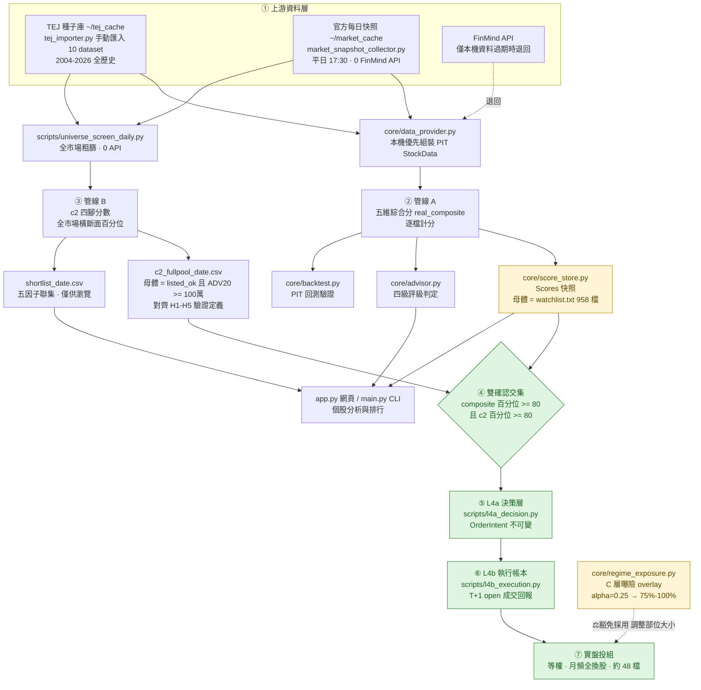

**這張圖最重要的兩件事：**

1. **管線 A 與管線 B 的母體不同。** A 的母體是人工維護的 `watchlist.txt`（958 檔），
   B 的母體是逐日全市場 ADV 篩選。兩邊算出的百分位不在同一個分母上——這是**已知未修的落差**。
2. **下游有兩條完全不同的分岔。** 走 `FUSE → L4a → L4b` 的投組路徑才是通過 H1–H5 驗證的策略；
   走 `advisor → 四級評級` 的網頁路徑從未走過完整預註冊驗證。

---

## D2 · 上游資料層：來源優先序與新鮮度閘門

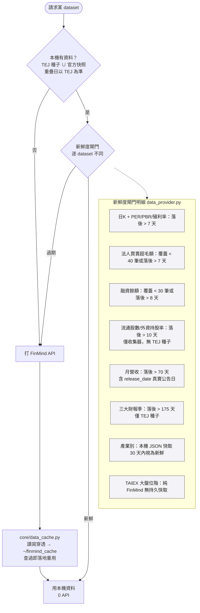

**PIT 三道防線**（`core/backtest.py`）：價格/PER/月營收只取 `date <= as_of`；
季報只用「公告日 + 45 天 <= as_of」；報酬量測允許看未來收盤價（那是結果不是輸入）。

---

## D3 · 管線 B：全市場粗篩漏斗（含 fail-closed 中止點）

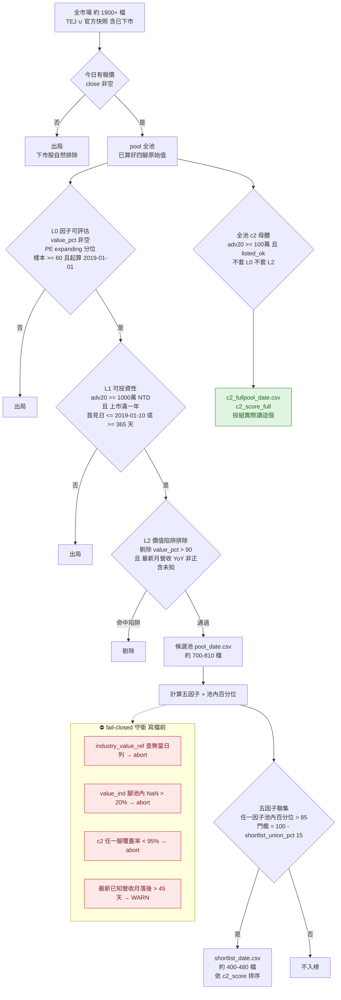

### 五因子與 c2 的關係

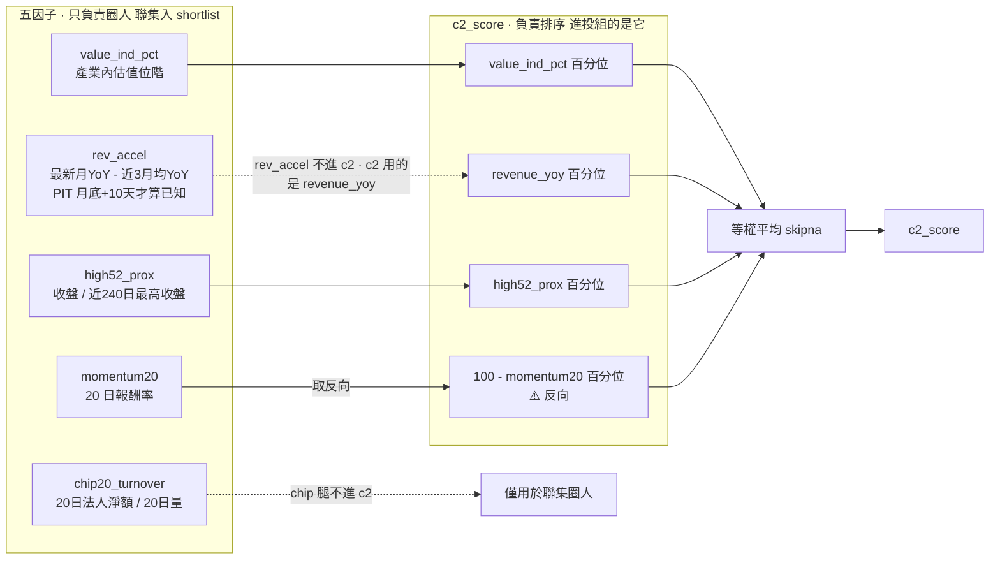

> **注意兩個常見誤解**：①`chip20_turnover` 和 `rev_accel` 只參與「圈人」，**不進 c2 排序分**；
> c2 的營收腿用的是 `revenue_yoy` 不是 `rev_accel`。②動能腿在 c2 裡是**反向**的
> （`100 - momentum20_pct`），也就是 c2 偏好「短期沒漲、但便宜 + 營收成長 + 接近 52 週高」的股票。

---

## D4 · 管線 A：個股五維計分（子因子與配分）

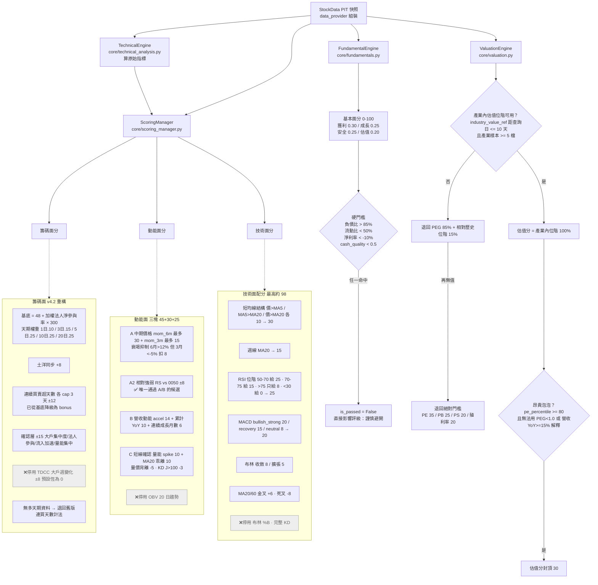

---

## D4a · 籌碼面「多天期法人淨參與率」完整算式

### 第一段：原始資料 → `net_ratio` 字典（`core/data_provider.py:1500-1574`）

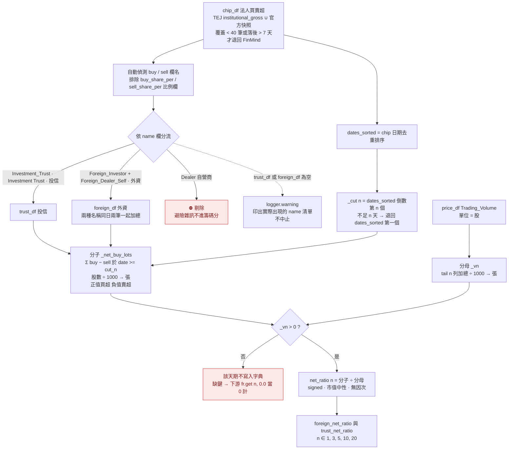

> **⚠️ 分子分母的窗不是同一把尺。** 分子的窗由 **chip 交易日**決定（`dates_sorted[-n]` 起、含當日往後全取），
> 分母是 **price_df 的最後 n 列**。兩邊日期覆蓋一致時等價；一旦 chip 天數不足 n
> （`_cut` 退回最早日），分子涵蓋的天數會**少於** n，分母仍取 n 天 → 該天期的比率被系統性稀釋。
> 這不是已量化過的偏誤，只是從程式碼讀出來的口徑落差，**列為待查項，不構成任何結論**。

### 第二段：`net_ratio` → 籌碼分（`core/scoring_manager.py:321-377`）

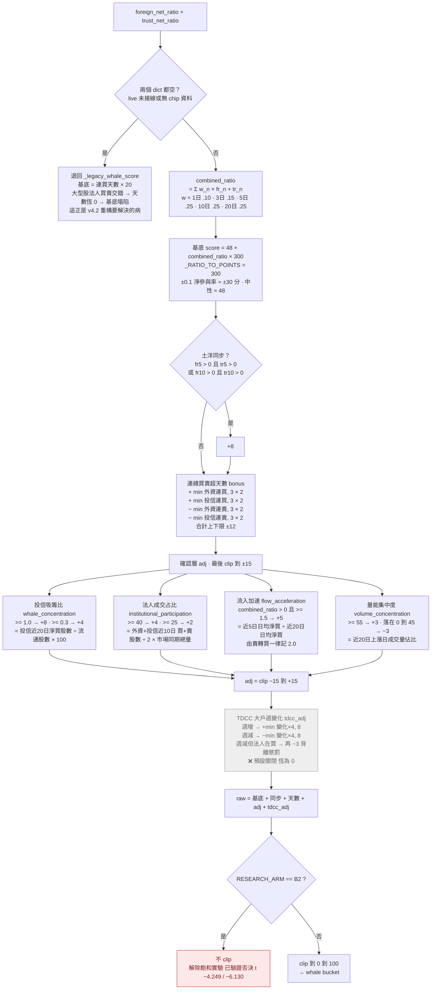

**攤平成一行的話：**

```
whale = clip(
    48
  + 300 × Σ_{n∈{1,3,5,10,20}} w_n × ( fr_n + tr_n )        ← 基底，w = .10/.15/.25/.25/.25
  + 8·[土洋同步]                                            ← 確認
  + 2·min(外資連買,3) + 2·min(投信連買,3)
  − 2·min(外資連賣,3) − 2·min(投信連賣,3)                    ← ±12
  + clip(吸籌比 + 法人占比 + 流入加速 + 量能集中, −15, +15)
  + tdcc_adj                                                ← 恆為 0
, 0, 100)
```

**這張圖要一起帶的三個事實**（來自 `docs/血緣稽核_五維度_2026-07-31.md`，不是新結論）：
籌碼面真身 Rank IC **−0.0119 (t −2.20)**，方向為負；**15.75% 的樣本撞到 clip 邊界**；
解除飽和（B2）已驗證**否決**。也就是說這條精算過的算式，在排序上目前是負貢獻。

---

## D5 · 五維合成：兩層權重調整（引擎最容易被忽略的一段）

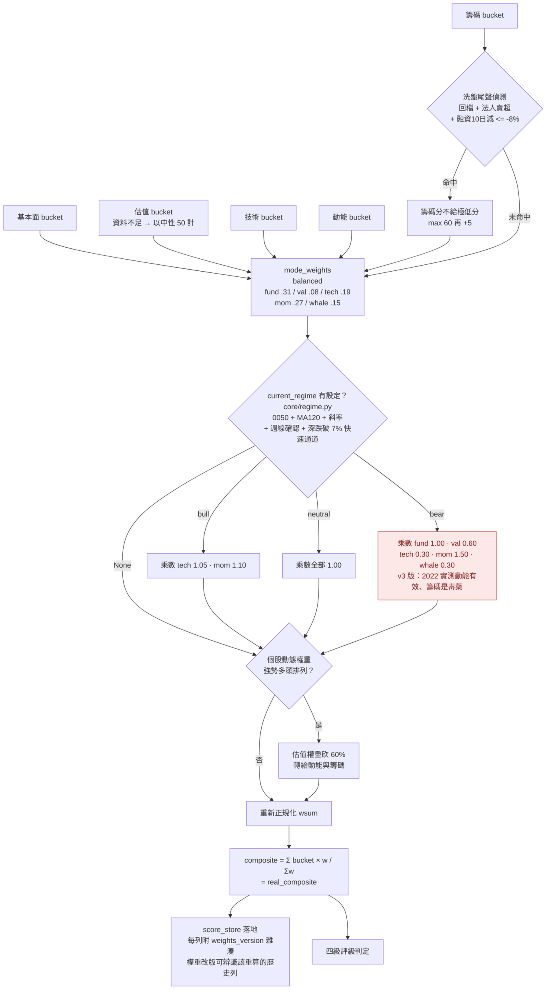

> **⚠️ 兩套「大盤多空」不是同一個節點，畫圖時務必分開：**
>
> | | `core/regime.py` | `universe_screen_daily.py::bear_regime` |
> |---|---|---|
> | 基準 | 0050 單檔 | 自建全市場等權指數 |
> | 均線 | MA120 + 斜率 + 週線確認 + 不對稱冷卻 | MA200 |
> | 效果 | **實際改變**評分權重與評級門檻 | **僅顯示警示**，不回饋任何篩選/排序 |
>
> `classify_regime()` 在 2005-2018 的 168 個月一律回 `neutral` → regime 乘數從未生效；
> **2019 年後才真正生效**（B 層）。所以「本體 A 無 regime」是錯誤描述。

### 四級評級判定順序（網頁/CLI 路徑，非投組路徑）

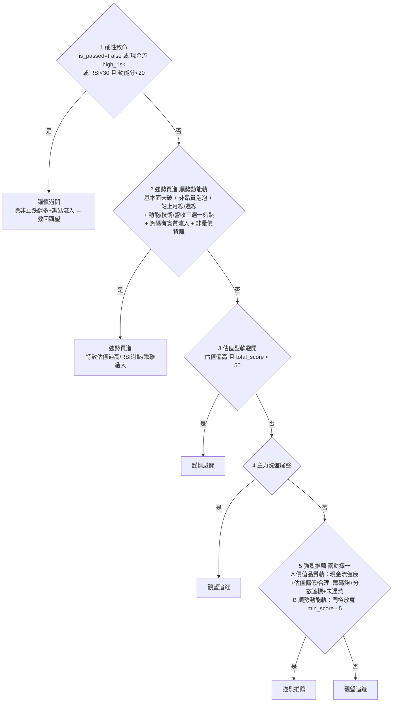

門檻依模式浮動（balanced 示例）：`min_score=54`、mom_hot 46 / whale_hot 42 / rev_hot 12 / tech_hot 65；
rsi_overbought 72 / rsi_extreme 78 / bias_chase 15 / chip_min 30。bear 段再由 `regime_rating_gates` 墊高。

---

## D6 · 交集 → L4a → L4b：投組生成的事件時序

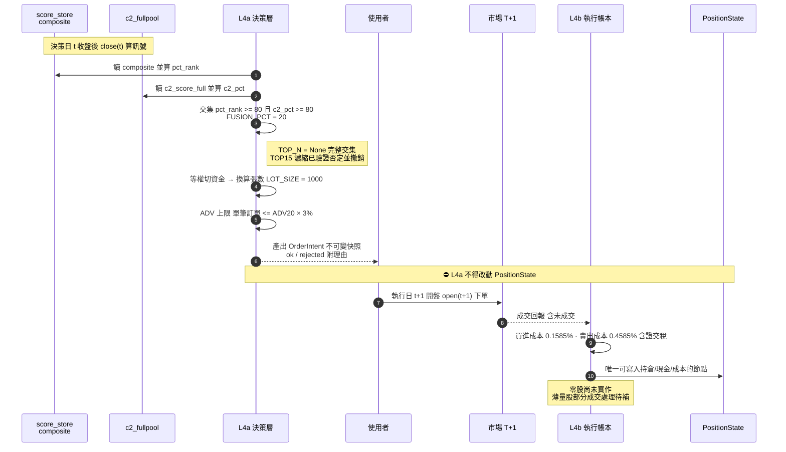

**L4a 的四種 rejected 理由**：`無參考價`、`ADV20 缺失`、`資金不足一張`、以及 `adv_capped` 下修標記。

---

## D6a · L4a 張數換算與 ADV 上限（`scripts/l4a_decision.py:185-284`）

### 第一段：可投入資本怎麼算（這裡出過一個系統性低估的 bug）

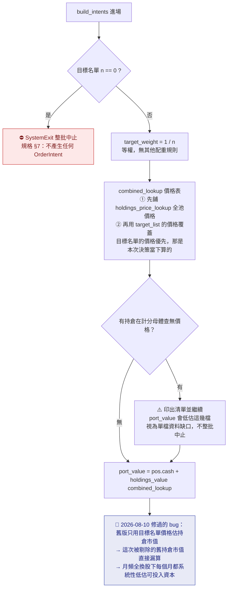

> **資金唯一來源是 `pos.cash` + 持倉市值。** 曾經有過 `available_capital` 參數但函式體從未讀它，
> 是死參數、容易被誤讀成「資金從這裡流入」，2026-08-10 已移除。首次執行的起始資金是
> `PositionState.empty()` 之後由 `--init-empty` 分支手動設 `pos.cash`。

### 第二段：逐檔換算張數 → OrderIntent

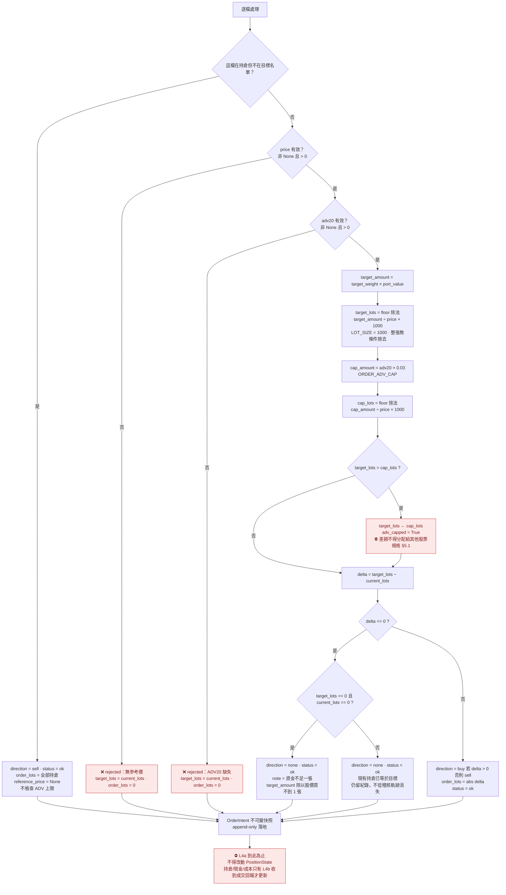

**兩個關鍵設計選擇，重新檢視時值得停下來看：**

1. **ADV 上限是「下修」不是「重分配」。** 一檔薄量股被 3% 上限砍掉的額度，
   **不會**攤到其他股票 → 實際部位總和會低於 100%，殘額留在現金。
   這是刻意的：重分配等於偷偷改變等權定義，而等權是 H1–H5 驗過的那個配置。
2. **`target_lots = 0` 有兩種完全不同的原因**，程式碼刻意分開記：
   (a) 資金 ÷ n 檔後買不到一張（小資金 + 高價股）；(b) 現有持倉已等於目標。
   前者就是 `TOP_N=15` 濃縮想解決卻被 H4 滑價否決的那個真問題 ——
   **問題還在，只是「取固定前 15 檔」這個解法被否定了**，目前沒有驗證過的替代解。

> 零股仍未實作。以現行規則，**資金不足一張的部位就是落空**，
> 這也是 §5.7 要求先小額活體演練的原因之一。

---

## D7 · C 層曝險 overlay（⚖️ 研究否定 + 使用者豁免採用）

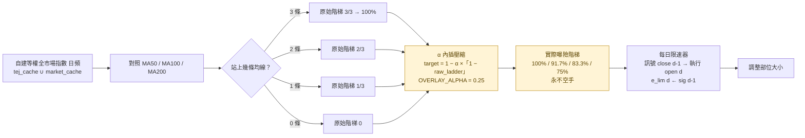

**引用這一項時三個但書必須一起帶：**
① 價值集中在 2008，而該段對訊號是 in-sample；
② **2022 型陰跌幫不上忙**（MDD 僅 +1.27pp、CAGR 反而 −2.17pp）；
③ HO2 失敗 → **不得宣稱擇時 alpha**，只能說是有效減碼（MDD 改善主要來自平均只持 67.4% 曝險）。
即使套用，全期回撤仍約 −62.7%，**部位大小仍是主要風控**。

---

## D8 · 每日自動化排程事件流

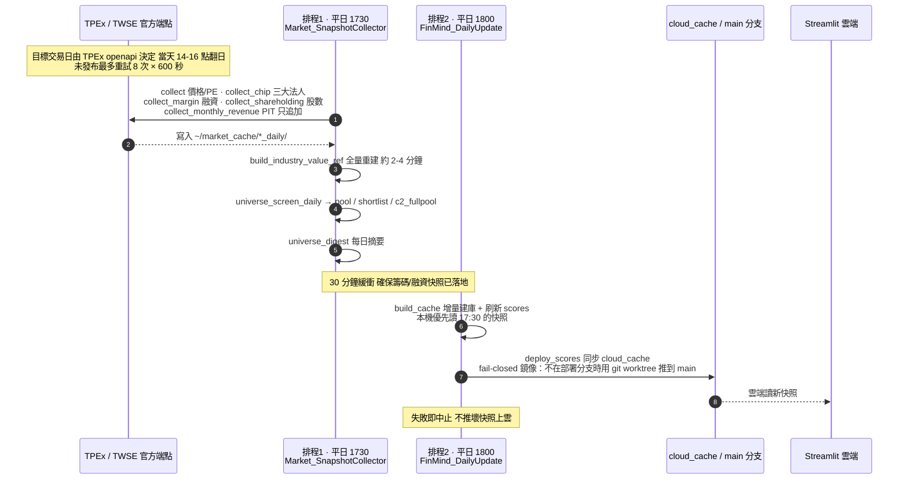

兩個工作皆以 `wscript.exe //B //Nologo run_hidden.vbs` 隱藏執行，設定 `-StartWhenAvailable -WakeToRun`。

---

## D9 · 驗證狀態總覽（哪一段是「驗過的」）

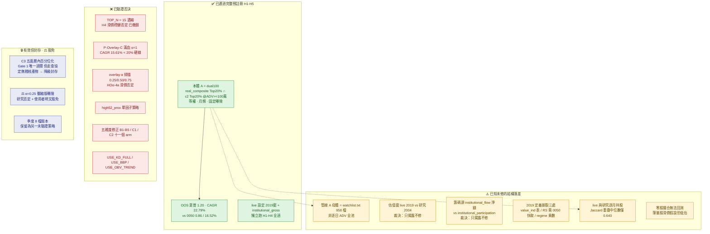

---

## 附錄 · 關鍵常數速查（附 file:line）

| 常數 | 值 | 位置 |
|---|---|---|
| `MIN_PCT_SAMPLES` | 60 | `scripts/universe_screen_daily.py:50` |
| `PE_HISTORY_START` | 2019-01-01 | 同上 :51 |
| `DATA_START_CUTOFF` | 2019-01-10 | 同上 :53 |
| `REVENUE_LAG_DAYS` | 10 | 同上 :54 |
| `VALUE_IND_MAX_NAN_PCT` | 20.0（超過即 abort） | 同上 :58 |
| `LEG_MIN_COVERAGE_PCT` | 95.0（低於即 abort） | 同上 :61 |
| `REVENUE_STALE_WARN_DAYS` | 45 | 同上 :62 |
| `--adv-floor` | 10,000,000（粗篩池） | 同上 :111 |
| `--shortlist-union-pct` | 15.0（→ 門檻 >85） | 同上 :114 |
| `--full-pool-adv-floor` | 1,000,000（對齊 H1-H5） | 同上 :122 |
| balanced `composite_weights` | .31/.08/.19/.27/.15 | `core/scoring_manager.py:53` |
| balanced `min_score` | 54 | 同上 :55 |
| `_HORIZON_WEIGHTS` | 1:.10 3:.15 5:.25 10:.25 20:.25 | 同上 :298 |
| `_RATIO_TO_POINTS` | 300.0 | 同上 :299 |
| `USE_RS_OVERLAY` | True | 同上 :17 |
| `USE_KD_FULL` / `USE_BBP` / `USE_OBV_TREND` | False | 同上 :18-20 |
| `REGIME_MULTIPLIERS` bear | fund 1.00 / val .60 / tech .30 / mom 1.50 / whale .30 | `core/regime.py:33` |
| 基本面分組權重 | 獲利 .30 / 成長 .25 / 安全 .25 / 估值 .20 | `core/fundamentals.py:30-33` |
| 基本面硬門檻 | 流動比 50 / 淨利率 -10 / cash_quality 0.5 | 同上 :62-64 |
| `OVERLAY_ALPHA` | 0.25 | `core/regime_exposure.py:79` |
| `FUSION_PCT` | 20 | `scripts/l4a_decision.py:45` |
| `TOP_N` | None（濃縮已撤銷） | 同上 :56 |
| `ORDER_ADV_CAP` | 0.03 | 同上 :43 |
| `LOT_SIZE` | 1000 | 同上 :46 |
| `BUY_COST` / `SELL_COST` | 0.001585 / 0.004585 | `scripts/l4b_execution.py:54-55` |
| 淨參與率分子 | Σ(buy−sell) 於 `date >= _cut(n)`，÷1000 → 張 | `core/data_provider.py:1052-1066` |
| 淨參與率分母 | `price_df.Trading_Volume.tail(n).sum() / 1000` | 同上 :1567-1574 |
| 自營商 | **剔除**，不進籌碼分 | 同上 :1528 |
| `flow_acceleration` | 近5日日均淨買 ÷ 近20日日均淨買；由賣轉買記 2.0 | 同上 :1544-1554 |
| `institutional_participation` | 外資+投信近10日(買+賣)股數 ÷ (2 × 市場同期總量) × 100 | 同上 :1556-1561 |
| `whale_concentration` | 投信近20日淨買股數 ÷ 流通股數 × 100 | 同上 :1590 |

---

*本文件為程式碼現況的靜態快照（2026-08-11）。若之後改動評分邏輯/篩選參數/部署層，
請重新掃描程式碼更新本文件，不要手動修改數字。*
